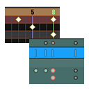
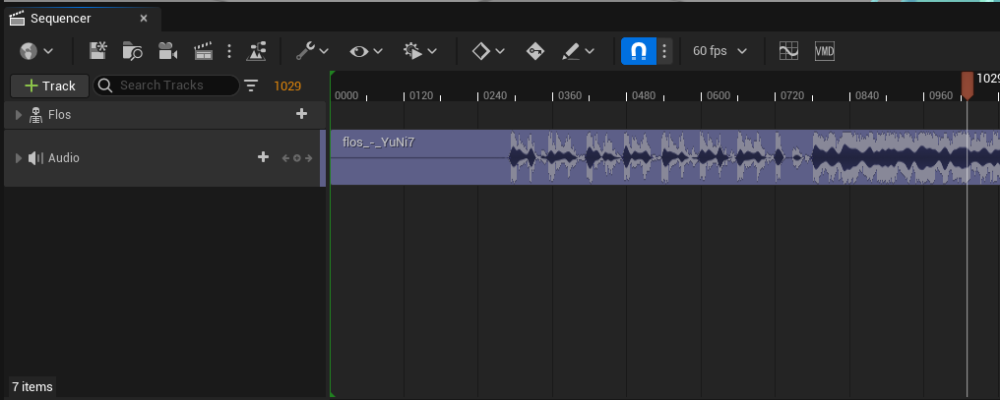
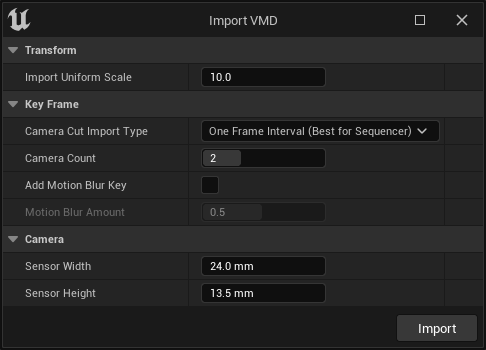
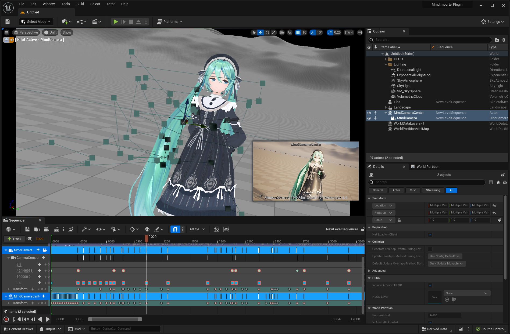
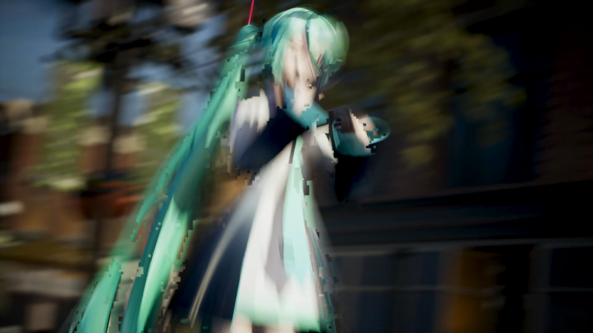

# Mmd Camera Importer Plugin

## Unreal Engine plugin for import MMD Camera Animation

- Tested on Unreal Engine 5.0.3, 5.1.0, 5.1.1, 5.2.0 Preview1

## Installation

### [Download Link](https://github.com/noname0310/UE-MMD-Camera-Importer/releases/download/v1.0.3/MMDCameraImporter_v1.0.3.zip)

- Close the Unreal Editor

- Download the plugin from the link above and extract it into the `{ProjectRoot}/Plugins` folder of the project. If you don't have a folder, create it.

## How to use

If the plugin was installed, a VMD button would appear on the far right side of the sequencer toolbar.

Press the button and select the desired camera motion file.

After that, the import option will come out. By default, you do not need to touch any settings.

Press Import to bring up camera motion.

The mmd camera is created and the keyframe is loaded.

**In this state, you must open the curve editor and select all tracks once.(due to bug)**

The import is finished. Congratulations.

## Why should I use this?

There are other ways to bring MMD's camera motion to the unreal engine.

But they lacked some elements, so they were incomplete.

**The issue solved by this importer is the natural transition between camera cuts.**

For mmd, by default, the cubic interpolation is used to interpolate keyframes, but if two keyframes are closely spaced by one frame, it performs constant interpolation.

Since these characteristics do not exist in other animation systems, it is necessary to apply an algorithm that looks at the distance between keyframes and selects the appropriate interpolation method.

**The problems are described in detail below, and this is also an explanation of the import option.**

### Problem1: Camera cut at 60 frame motion

This is usually the case when using a blender plugin mmd tools to load camera motion into the unreal engine via fbx.

Because mmd is a 30 frame animation, rendering in 60 frames results in an oddly interpolated cut between camera cuts.

This result can be obtained when the `Camera Cut Import Type` is `Import As Is`.

### Problem1(solve method1): Place two keyframes one frame apart

One of the ideal solutions is to place two keyframes one frame apart.

And this is done automatically in the Mmd Importer Plugin.

This result can be obtained when the `Camera Cut Import Type` is `One Frame Interval`.

### Problem1(solve method2): Use constant interpolation

This is a reproduction of the interpolation method performed by a MMD.

However, this method has a problem with the camera stopping one frame before the transition is performed.

if you want to get the same results as MMD, it is also good to use this method.

This result can be obtained when the `Camera Cut Import Type` is `Constant Key`.

### Problem1(solve method3): Use both methods 1 and 2

If you think a little bit about the constant interpolation of MMD, you can see that it is designed so that there is no problem with the camera cut in any frame over 30 frames.

However, method 1 only imports assuming proper behavior at a fixed frame rate.

So I added a option that combines the two methods.

This method is good in situations such as games with a dynamic frame rate.

This result can be obtained when the `Camera Cut Import Type` is `One Frame Interval With Constant Key`.

### Problem2: Motion Blur

The mmd camera teleports in the camera cut, so a motion blur is instantaneously generated during one frame.

https://www.youtube.com/watch?v=7AG0GKHO7bc
This video has the problem.

As shown in the picture above, there is a problem of creating a bad-looking motion blur.

### Problem2(solve method1): Add Motion Blur Track

So to solve this problem, I added a function of turning off the motion blur only from the camera cut.

This is the function shown on the import menu.

If you import, this is how motion blur tracks appear on the camera.

### Problem2(solve method2): Use Multiple Cameras

Create a camera cut by swapping multiple cameras (at least two).

In Import Settings, you can determine the number of cameras. The maximum value is 4.

This picture shows four cameras swapping each other and use splitted camera motion.

This method provides the cleanest results in Sequencer.

## Knowns Issues

- The curve tangent value is applied after observing the curve with the curve editor. (I think it's a lazy evaluation issue. I'm looking for solution.)
